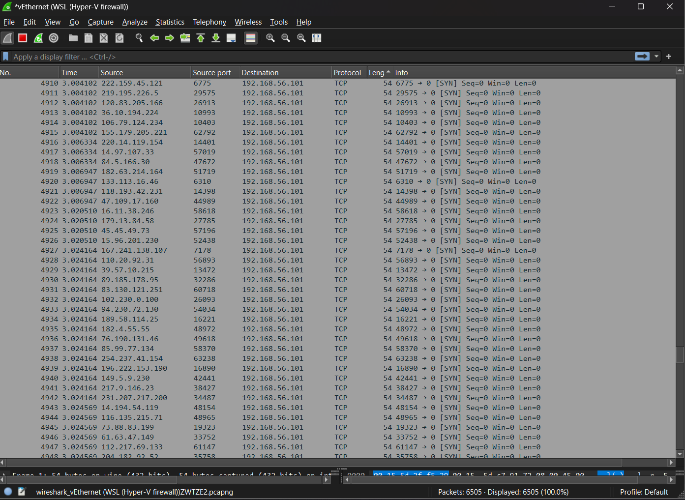

# SYN-flood

<hr>

DISCLAIMER: **This repo is created to demonstrate how a SYN-flood attack can be performed. Hacking without permission is illegal. This is strictly educational purposes.**

<hr>

## Usage

```bash
make
```

Followed by
```
sudo ./syn-flood <IP> <PORT>
```


## Brief explanation

This program is relatively simple. It makes use of raw sockets to create a SYN TCP packet with all the required data, where it randomizes the source IP and port.

After this, in the main function the program enters a loop where it sends thousands of packets to the destination IP and port. The packet's source IP and port are spoofed and randomized in every iteration, see the following wireshark screenshot:



